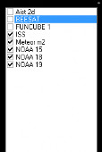
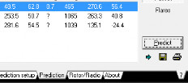

Usage
=====

.. _installation:

Software Installation - Windows 
------------

To install on windows, first click this link to download this repo: `Download <https://github.com/KOIDABAWS/ISP-AMSAT/archive/refs/heads/main.zip>`_

Then extract the files from the .zip file and run the .bat file named AMSAT

After all the files finish downloading, run the file downloaded named sdrsharp-installer.exe 

Then run the file in AMSAT named install-rtlsdr, and then the other two .exe files downloaded, making sure to follow any on screen instructions, and ensure that Orbitrons files are directed to where SDRSharps files are.

Software Usage
------------

First, you need to track the satellites. To do this, open Orbitron and click the button which says Load TLE.

For the NOAA satellites, click NOAA, and select NOAA 15, 18 and 19 from the list.

Then go to the predictions tab, and set the elevation of the satellite to between 30-45 degreen, then click predict, which should get you a list of dates and times, be sure to be out with your gear 10 minutes ahead of time.

Collecting Data
---------------

Once the antenna and SDR are plugged in, open SDRsharp. Each satellite broadcasts at a slightly different frequency, so look up what the expected frequency for the satellite pass you've chosen. For example, NOAA 15 broadcasts at 137.63 Mhz.

In the SDR settings menu, set the type of radio to Wide band FM (WFM). The signals bandwidth is about 50 Khz but you'll want to set the SDR's bandwidth wider than that. As the satellite moves the signal is doppler shifted based on if the satellite is moving toward or away from you. Adding some extra bandwidth helps account for that.

In the Recording settings, uncheck Baseband, and select Audio.

Press the play button at the top left to start receiving radio signals. As the satellite comes over the horizon, you should start seeing a wavey peak that leaves very distinct line on the waterfall. You should also hear a distinct beeping. You can adjust the gain settings by clicking the gear in the top left.

To get the signal to come in clearly, you may need to rotate and shift the antenna around and play with the gain. Once that is done, and you can hear little to no static, click the record button in the audio recording menu. Make sure the frequency selector stays roughly centered on the signal until the satellite sets. When the signal gets too bad or the satellite has set, stop the recording and click stop in the top left to turn off the SDR. 

Then we have to resample the audio to be slower so WXtoIMG can interpret it.

Open Audacity, and load the recording. In the bottom left corner there's drop down menu called Project Rate. Click it and select 11025. Then click the Tracks menu at the top, click Resample and then again select 11025 if it doesn't show up on it's own. Then click Resample. Export the recording.

Then open WXtoIMG, click load audio, and select your recording. Then relax and watch your image come to life!
