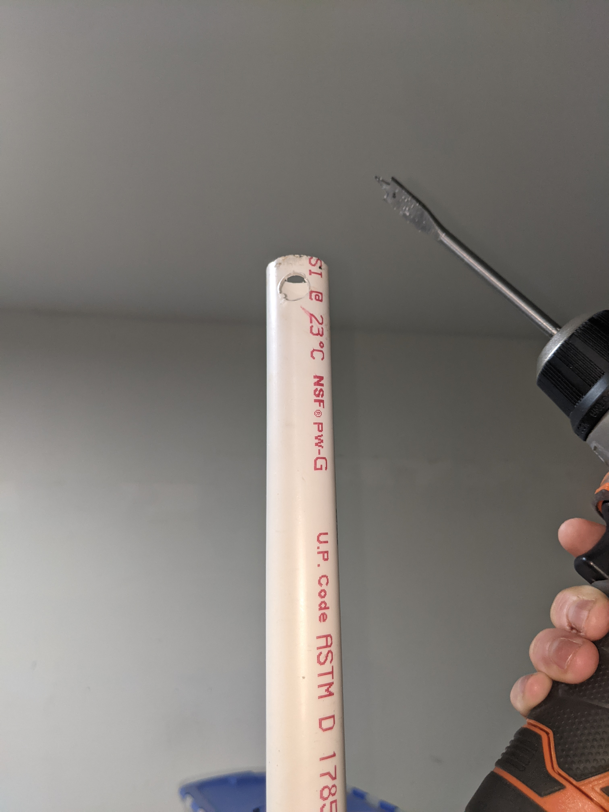
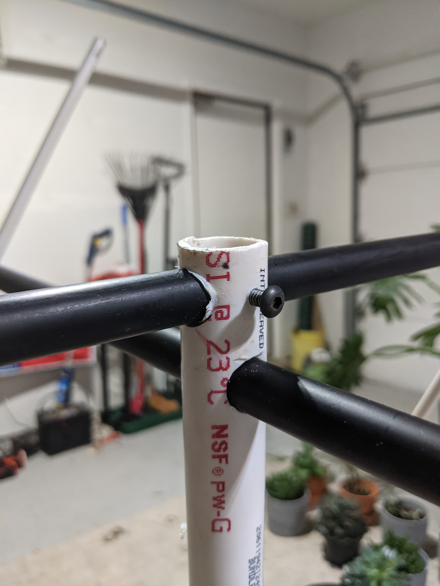
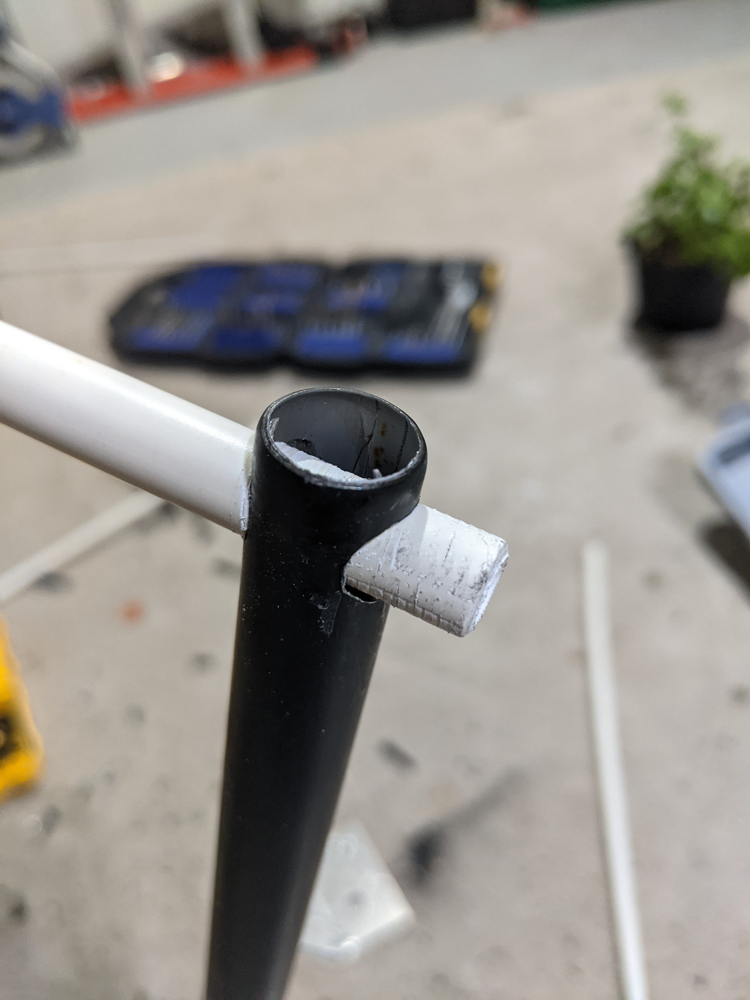
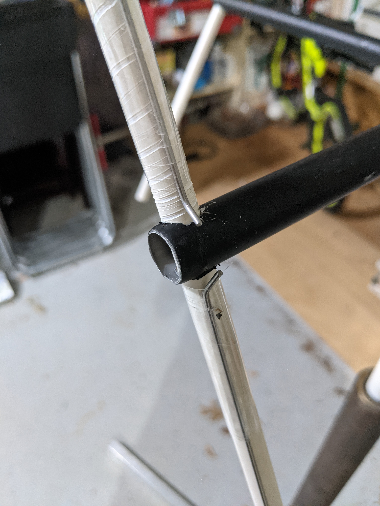
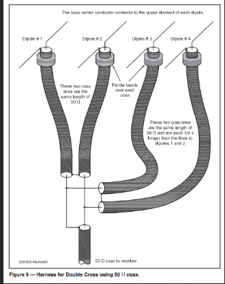
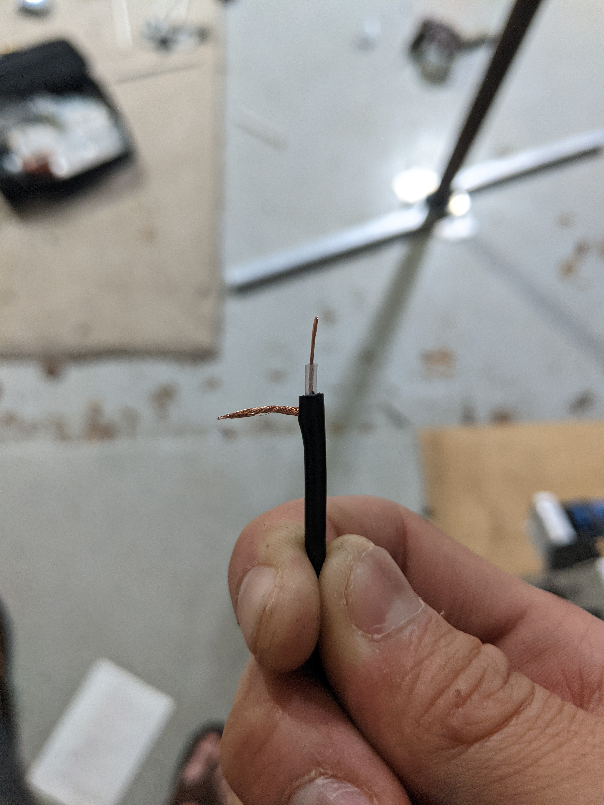
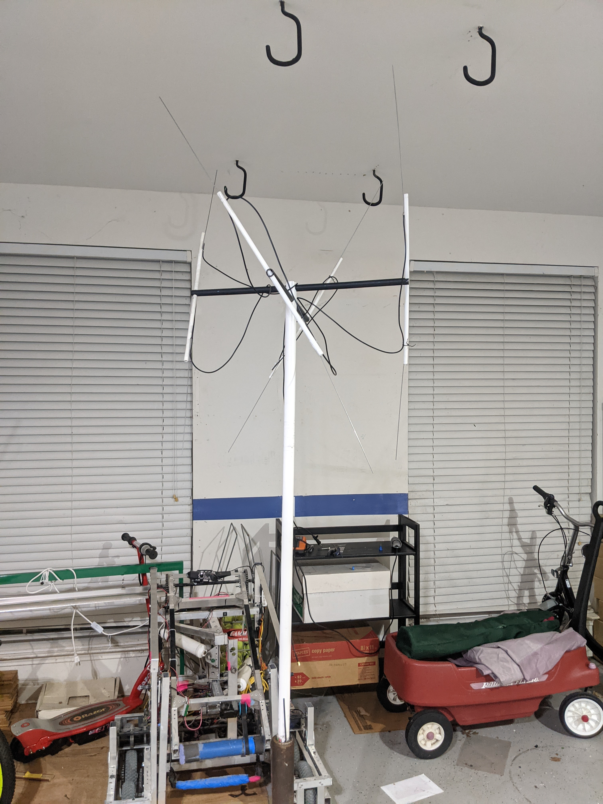

Antennae Walkthrough
====

.. _materials:

Hardware/Materials
------------------

To create and interface with an antenna, you will need:

* 1x shaft or pole, such as a 2x4 or PVC pipe approximately 6' long

* 2x smaller poles, preferably not metallic/conductive 21" long, 3/4" diameter

* 4x 1/4" diameter rods 

* 8x 28" long piano wire

* 20' Coaxial cable (50 ohm)

* Soldering Iron/Toolkit

* RTL-SDR

* Drill + Drill bits 

.. _walkthrough:

Assembly
--------

First, drill two holes in the PVC/2x4 90 degrees apart in the same size as your smaller poles offset in height by the size of the hole, and insert the smaller poles as seen in the pictures below.

Then, drill holes through the poles, the same size as the small rods, 30 degrees offset for each pole as seen in the picture below. (rods inserted to demonstrate angle.

.. image:: pole1.jpg
   :width: 25 %
.. image:: angle.jpg
   :width: 25 %

Next, bend the piano wire on the ends 1/4" approximately 30 degrees up, and tape two to the each of the rods, approx 1" apart from the center of the rods.

   
Then, cut the coax into 4 pieces, two 21" and two 42", and strip the ends of the coax cable to reveal the sheathing and core, then solder the wire according to the below diagram. The diagram looks complex, however essentially, we are going to be soldering one piece of coax to each pair of piano wires, with the sheathing to the lower piano wire in the piano wire pairs and core to the upper. Then connect these wires back to each other, and to the rest of the coax wire.

Then, just add a SMA connector to the end of the coax, and connect it to the RTL-SDR and plug it into your computer.
